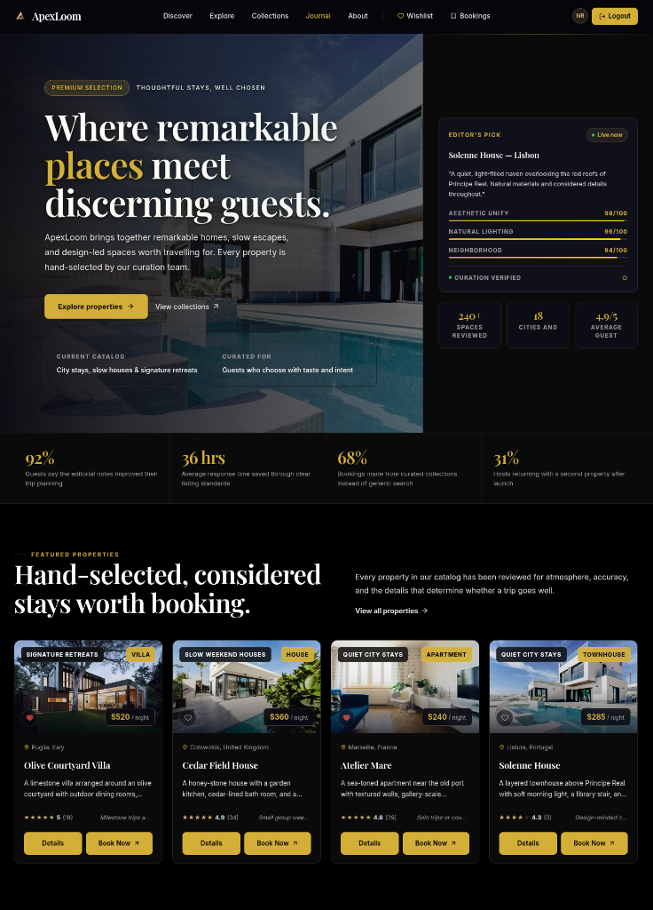

<div align="center">

  

  [](https://github.com/iMoloy/apexloom)

</div>

---

## 📖 Overview

**ApexLoom** is a premium, high-end booking web application designed for curated travel stays and boutique hotel experiences. Built using Next.js, MongoDB, and Firebase Auth, it features a state-of-the-art dark theme, glassmorphic UI components, smooth micro-animations, and interactive dashboards.

---

## 🛠️ Technologies Used

| Technology | Version | Purpose |
|---|---|---|
| [Next.js](https://nextjs.org/) | `16.2.10` | React framework (App Router) |
| [React](https://react.dev/) | `19.2.4` | UI library |
| [Tailwind CSS](https://tailwindcss.com/) | `^4` | Utility-first styling |
| [DaisyUI](https://daisyui.com/) | `^5.6.17` | Component library |
| [Firebase](https://firebase.google.com/) | `^12.16.0` | Client-side SDK (Google Auth) |
| [Mongoose](https://mongoosejs.com/) | `^9.7.4` | MongoDB ODM |
| [Recharts](https://recharts.org/) | `^3.9.2` | Host dashboard metrics and graphs |
| [Lucide React](https://lucide.dev/) | `^1.24.0` | SVG Icon library |

---

## ✨ Core Features

- **Curated Stays Marketplace** — Browse premium listings and filter by location, collection, and price.
- **Firebase & Google Authentication** — Seamless integration for secure user sign-in via Google Social Login.
- **Host Analytics Dashboard** — Interactive charts showing income, booking trends, occupancy rates, and listing statistics.
- **Interactive Booking Widget** — Integrated stay reservation flow with cost calculation, guest selector, and booking simulation.
- **Stays CRUD Management** — Split-pane panel allowing hosts to publish (supporting Cover, Lounge, and Suite image uploads via ImgBB), update, delete, and monitor their listings.
- **Mongoose & MongoDB Integration** — Dynamic persistence for listings, booking history, user sessions, and reviews.
- **Live Chat Widget** — Elegant, expandable floating widget to support user queries.
- **Responsive, Bento Grid UI** — Premium CSS styling with custom glassmorphism, input glows, and bento-grid components.

### Route Permissions

| Route | Access |
|---|---|
| `/`, `/about`, `/contact`, `/explore`, `/login`, `/register`, `/privacy`, `/stay-art/[slug]`, `/stays/[slug]` | Public |
| `/profile`, `/stays/add`, `/stays/manage` | Private (auth required) |

---

## 📦 Dependencies

### Production

| Package | Version | Purpose |
|---|---|---|
| `next` | `16.2.10` | Framework |
| `react` / `react-dom` | `19.2.4` | UI Library |
| `firebase` | `^12.16.0` | Firebase Auth client SDK |
| `mongoose` | `^9.7.4` | MongoDB Database ODM |
| `recharts` | `^3.9.2` | Charts and graphs |
| `lucide-react` | `^1.24.0` | SVG Icons |

### Development

| Package | Purpose |
|---|---|
| `tailwindcss` `^4` | Styling framework |
| `@tailwindcss/postcss` `^4` | Tailwind PostCSS compiler |
| `daisyui` `^5.6.17` | Component classes |
| `typescript` `^6.0.3` | Static typing |
| `eslint`, `eslint-config-next` | Linting configurations |

---

## 🚀 Run Locally

### Prerequisites
- **Node.js** v18 or higher
- **MongoDB Atlas** URI
- **Firebase Web App Config** (API Key, Project ID, App ID, etc.)

### Steps

1. **Clone the repository**

   ```bash
   git clone https://github.com/iMoloy/apexloom.git
   cd apexloom
   ```

2. **Install dependencies**

   ```bash
   npm install
   ```

3. **Configure environment**

   Create `.env.local` based on `.env.example`:

   ```env
    # Database URI
    MONGODB_URI="your-mongodb-atlas-connection-string"
    JWT_SECRET="your-jwt-cookie-signing-secret"

    # Firebase Config
    NEXT_PUBLIC_FIREBASE_API_KEY="your-api-key"
    NEXT_PUBLIC_FIREBASE_AUTH_DOMAIN="your-project.firebaseapp.com"
    NEXT_PUBLIC_FIREBASE_PROJECT_ID="your-project-id"
    NEXT_PUBLIC_FIREBASE_STORAGE_BUCKET="your-project.firebasestorage.app"
    NEXT_PUBLIC_FIREBASE_MESSAGING_SENDER_ID="your-sender-id"
    NEXT_PUBLIC_FIREBASE_APP_ID="your-app-id"

    # SMTP Configuration (Optional, for email receipts)
    SMTP_HOST="smtp.gmail.com"
    SMTP_PORT=587
    SMTP_SECURE="false"
    SMTP_USER="your_email@gmail.com"
    SMTP_PASS="your_app_password"

    # ImgBB Key
    NEXT_PUBLIC_IMGBB_API_KEY="your-imgbb-api-key"
    ```

---

## 🔐 Evaluation Credentials

For fast review and evaluation, use the one-click auto-fill buttons on the login screen or enter the following accounts manually:

| Role | Username / Email | Password |
|---|---|---|
| **Platform Host (Admin Dashboard)** | `host@apexloom.com` | `host123` |
| **Platform Guest (Booking Portal)** | `guest@apexloom.com` | `guest123` |
| **System Admin** | `admin@apexloom.com` | `admin123` |

---

## 4. Verify Database Connection

Check if the database connects successfully:
```bash
node test-db.js
```

5. **Start the development server**

   ```bash
   npm run dev
   ```

6. Open [http://localhost:3000](http://localhost:3000)

### Available Scripts

| Command | Description |
|---|---|
| `npm run dev` | Start development server |
| `npm run build` | Build for production |
| `npm run start` | Serve production build |
| `npm run lint` | Run ESLint check |

---

## 📸 App Preview

<div align="center">
  
</div>

---

<div align="center">
  
  
  <sub>Made with ❤️ by <strong>Moloy Krishna Paul</strong></sub>
  
  <p>
    <a href="https://github.com/iMoloy/apexloom" target="_blank">
      
    </a>
    &nbsp;&nbsp;
    <a href="https://linkedin.com/in/iMoloy" target="_blank">
      
    </a>
  </p>
</div>

